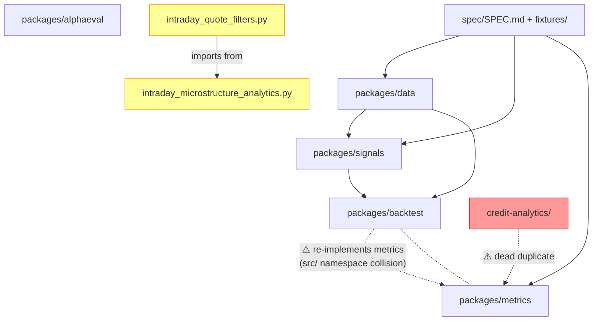

# Architecture Review Report

**Project:** FlowCode Credit Analytics
**Date:** 2026-03-01
**Files reviewed:** 62 Python files (~11.7k lines)
**Overall health:** 🟡 Adequate

## Codebase Summary

FlowCode is a corporate bond credit analytics platform structured as 5 Python packages (`data`, `signals`, `metrics`, `backtest`, `alphaeval`) under `packages/`, with 2 standalone root-level modules (~1800 lines of intraday microstructure analytics), a legacy `credit-analytics/` subdirectory, and spec/fixture/tool infrastructure. The packages enforce a clean DAG (`data → signals → metrics → backtest`), all formulas are spec-verified via `spec/SPEC.md`, and 363 tests pass across the packaged code. However, the intraday modules and credit-analytics subdirectory sit outside the governed package boundary with zero test coverage.

## Scorecard

| Dimension | Score | Key Finding |
|---|---|---|
| Boundary Quality | 🟠 | 1800 LOC of intraday analytics outside package hierarchy; dead `credit-analytics/` subtree |
| Dependency Direction | 🟡 | DAG maintained within packages; `src/` namespace collision blocks inter-package imports |
| Abstraction Fitness | 🟢 | Good use of pure functions, dataclasses, enums; no premature abstractions |
| DRY & Knowledge | 🟠 | `backtest/engine.py` re-implements Sharpe/drawdown; `credit-analytics/` duplicates 6 formulas |
| Extensibility | 🟡 | New signals/metrics = 1 new file; but new packages that compose existing ones are blocked by `src/` naming |
| Testability | 🟠 | 5 packages well-tested (363 tests); intraday modules (1800 LOC, most complex code) have 0 tests |
| Parallelisation | 🟡 | 4 intraday accumulators use sequential Python for-loops; per-ISIN parallelisation trivially possible |

**Overall: 🟡 Adequate — core packages are well-structured, but boundary issues (intraday orphans, dead subtree, namespace collision) will compound as the system grows.**

## Dependency Graph

## Detailed Findings

### AR-BND-001: Intraday modules orphaned from package hierarchy
- **Finding ID:** AR-BND-001
- **Dimension:** Boundary Quality
- **Severity:** 🟠 Weak
- **Location:** `intraday_microstructure_analytics.py` (893 lines), `intraday_quote_filters.py` (820 lines)
- **Principle violated:** Rate-of-change alignment; SRP boundary
- **Evidence:** Two standalone root-level `.py` files contain 22+16 public functions, 7+5 schema classes, 3 enums, and complex session-accumulator logic. They have no `__init__.py`, no `pyproject.toml`, no tests, no fixture files, and are not referenced by any package in `packages/`.
- **Impact:** ~1800 lines of the most numerically complex code in the repo are ungoverned — no test coverage, no spec parity checks, no import path for other packages to use. Any refactoring or extension risks silent regression.
- **Recommendation:** Promote to `packages/intraday/` with standard structure (src/, tests/), or if they're research code, move to a `research/` directory with a README clarifying their status.

### AR-BND-002: Dead `credit-analytics/` subtree
- **Finding ID:** AR-BND-002
- **Dimension:** Boundary Quality
- **Severity:** 🟠 Weak
- **Location:** `credit-analytics/` (entire subtree: `apps/api/main.py`, `packages/metrics/src/performance.py`, `tools/`, `skills/`, `spec/`)
- **Principle violated:** Single source of truth; DRY
- **Evidence:** `credit-analytics/packages/metrics/src/performance.py` (207 lines) contains older versions of `credit_pnl`, `sharpe_ratio`, `sortino_ratio`, `max_drawdown`, `expectancy` — all without NaN guards, edge-case handling, or logging that the main `packages/` versions have. `credit-analytics/apps/api/main.py` is a 12-line FastAPI stub. The subtree has its own `skills/`, `spec/`, `tools/`.
- **Impact:** Confuses contributors about what is canonical. The older `sortino_ratio` returns `np.inf` on zero downside (vs NaN in main). `average_holding_time` mutates its input DataFrame. If anyone imports from `credit-analytics/` they get unsafe code.
- **Recommendation:** Delete `credit-analytics/` entirely, or archive it as `_archive/credit-analytics/` with a note that it's superseded. No code in main packages depends on it.

### AR-DEP-001: `src/` namespace collision blocks inter-package imports
- **Finding ID:** AR-DEP-001
- **Dimension:** Dependency Direction
- **Severity:** 🟡 Adequate
- **Location:** All 5 packages: `packages/*/src/`
- **Principle violated:** Dependency Inversion (the collision forces duplication instead of composition)
- **Evidence:** `backtest/src/engine.py:82-123` contains a comment: "Cross-package imports are not possible due to shared `src/` namespace" and re-implements Sharpe ratio and max drawdown from `metrics/src/`. All 5 packages export their code under the `src` module name, so `import src.performance` is ambiguous.
- **Impact:** Adding any new package that needs to compose metrics with signals (e.g., a reporting package) will face the same collision and must either duplicate or vendor the functions.
- **Recommendation:** Rename each `src/` to its package name (e.g., `packages/metrics/metrics_lib/` or just use `pyproject.toml` to set the proper package name). This is a structural fix that should happen before adding more packages.

### AR-DRY-001: `compute_metrics` re-implements Sharpe + drawdown
- **Finding ID:** AR-DRY-001
- **Dimension:** DRY & Knowledge
- **Severity:** 🟠 Weak
- **Location:** `packages/backtest/src/engine.py:66-123`
- **Principle violated:** Knowledge duplication (same business rule, same formula)
- **Evidence:** `compute_metrics()` manually implements: Sharpe = `(μ/σ)*√252` (L92), drawdown = `(cum - peak)/peak` (L94-97), annualized return (L103-110). These are identical to `packages/metrics/src/performance.py:sharpe_ratio()` and `packages/metrics/src/risk.py:drawdown_series()`.
- **Impact:** Formula divergence risk. If Sharpe calculation changes (e.g., adding risk-free rate), two locations must be updated. The backtest version already lacks the `ddof=1` explicit annotation and NaN logging that metrics has.
- **Recommendation:** Fix AR-DEP-001 first, then replace `compute_metrics()` body with calls to `metrics.performance.sharpe_ratio()` etc.

### AR-TST-001: Intraday modules have zero test coverage
- **Finding ID:** AR-TST-001
- **Dimension:** Testability
- **Severity:** 🟠 Weak
- **Location:** `intraday_microstructure_analytics.py`, `intraday_quote_filters.py`
- **Principle violated:** Extensibility Checklist #3 (module boundaries tested)
- **Evidence:** 38 public functions + 12 schema classes + session accumulator loops + NaN guard logic — none tested. The `reviews/` directory has 6 review reports for these modules but no tests were created.
- **Impact:** Session accumulator edge cases (NaN at session boundary, reset-on-missing-data, cross-ISIN contamination via `_safe_diff`) are the highest-risk failure modes documented in CLAUDE.md's Failure Mode Catalog, yet they have zero automated regression coverage.
- **Recommendation:** Prioritize tests for `_make_reset_mask`, `intraday_spread_range`, `cumulative_spread_move`, `_safe_diff`, and `detect_directional_pressure` — these are the most complex and edge-case-prone.

### AR-EXT-001: Adding a new package that composes existing ones
- **Finding ID:** AR-EXT-001
- **Dimension:** Extensibility
- **Severity:** 🟡 Adequate
- **Location:** `packages/*/src/` (all packages)
- **Principle violated:** Open/Closed at the inter-package level
- **Evidence:** Attempted extension: "Add a reporting package that combines metrics output with signal output." Required: new `packages/reporting/src/`. Blocked by: `src/` namespace collision (AR-DEP-001). Workaround: duplicate or vendor functions. Result: 4+ files modified + forced duplication = 🟠.
- **Impact:** The system can grow vertically (new signals, new metrics) easily (1 file), but cannot grow horizontally (new packages that compose existing packages) without the namespace fix.
- **Recommendation:** Address AR-DEP-001 first; then new composition packages become trivial.

### AR-PAR-001: Sequential Python for-loops in intraday accumulators
- **Finding ID:** AR-PAR-001
- **Dimension:** Parallelisation Readiness
- **Severity:** 🟡 Adequate (missed opportunity, not a bug)
- **Location:** `intraday_microstructure_analytics.py:537-549`, `553-599`, `798-809`, `836-849`
- **Principle violated:** N/A (opportunity)
- **Evidence:** `intraday_spread_range`, `cumulative_spread_move`, `spread_time_profile`, `time_at_spread` all use Python `for i in range(n)` loops. Each processes one ISIN at a time. For a universe of ~8000 ISINs × ~80 bins/day, that's ~640k iterations per day, per function, in Python.
- **Impact:** At production scale, these will be the bottleneck. Each ISIN's accumulation is independent — embarrassingly parallel.
- **Recommendation:** (1) Vectorize the simple accumulators using `pandas.groupby + cummax/cummin/cumsum` (spread_range, cumulative_move). (2) For `spread_time_profile`/`time_at_spread`, consider Cython/Numba or `concurrent.futures.ProcessPoolExecutor` for per-ISIN parallelism.

### AR-ABS-001: Appropriate function-level abstractions
- **Finding ID:** AR-ABS-001
- **Dimension:** Abstraction Fitness
- **Severity:** 🟢 Strong
- **Location:** All packages
- **Principle violated:** None
- **Evidence:** All signal functions are pure `(pd.Series, ...) → pd.Series`. All metric functions are pure `(pd.Series) → float`. No classes with single methods. `BacktestResult` is a clean dataclass. `EvalConfig`/`MetricResult` are lightweight data holders. Schema dataclasses in intraday modules map column names without over-engineering. No premature ABCs.
- **Impact:** Positive — easy to test, compose, and reason about.
- **Recommendation:** Preserve this pattern. If new signals are added, resist the temptation to create a `SignalGenerator` ABC until there are 3+ concrete implementations.

## Positive Highlights

1. **Clean DAG within packages** — The dependency flow `data → signals → metrics → backtest` is enforced and no circular imports exist. Each package has a well-defined `__init__.py` with explicit `__all__`.

2. **Spec as single source of truth** — The `spec/SPEC.md` → `spec/fixtures/*.json` → test pattern is well-designed. 18 formulas are registered, all have fixture files, and tests load from fixtures rather than hardcoding expected values.

3. **Defensive numeric code** — The packages handle NaN, inf, zero-division, insufficient-history, and edge cases consistently. Guards use `logger.warning()` not silent fallbacks. The alphaeval package is particularly thorough (every public function has explicit NaN path handling).

4. **Pure function design** — All signals and metrics are stateless pure functions. No side effects, no global state, no mutation of input DataFrames. This is excellent for both testing and future parallelisation.

## Recommended Review Cadence

Re-run this review:
- **Before** promoting intraday modules to packages (AR-BND-001)
- **After** fixing the `src/` namespace collision (AR-DEP-001)
- **Before** adding any new package that needs to compose existing packages
- **After** deleting `credit-analytics/` (to verify no broken imports)

---

## Handoff

| Dimension | Score | Key Finding |
|---|---|---|
| Boundary Quality | 🟠 | 1800 LOC intraday modules outside package hierarchy; dead credit-analytics subtree |
| Dependency Direction | 🟡 | `src/` namespace collision blocks inter-package imports |
| Abstraction Fitness | 🟢 | Pure functions, appropriate dataclasses, no premature abstractions |
| DRY & Knowledge | 🟠 | backtest/engine.py re-implements Sharpe/drawdown; credit-analytics duplicates 6 formulas |
| Extensibility | 🟡 | Vertical extension easy (1 file); horizontal composition blocked by namespace |
| Testability | 🟠 | 363 tests for packages; 0 tests for 1800 LOC intraday code |
| Parallelisation | 🟡 | 4 sequential for-loops in intraday; per-ISIN parallelisation trivially possible |

| Finding ID | Severity | Dimension | Location | Summary |
|---|---|---|---|---|
| AR-BND-001 | 🟠 | Boundaries | `intraday_*.py` (root) | 1800 LOC of complex analytics outside package hierarchy with zero tests and no import path for other packages |
| AR-BND-002 | 🟠 | Boundaries | `credit-analytics/` | Dead subtree with older, less-defensive duplicates of 6 formulas; confuses what is canonical |
| AR-DEP-001 | 🟡 | Dependencies | `packages/*/src/` | Shared `src/` module name across all 5 packages blocks inter-package imports, forcing duplication |
| AR-DRY-001 | 🟠 | DRY | `backtest/src/engine.py:66-123` | `compute_metrics()` re-implements Sharpe + drawdown from metrics package due to namespace collision |
| AR-TST-001 | 🟠 | Testability | `intraday_*.py` (root) | 38 public functions, 12 schema classes, session accumulators — all untested despite being highest-risk code |
| AR-EXT-001 | 🟡 | Extensibility | `packages/*/src/` | New composition packages blocked by `src/` namespace; workaround is forced duplication |
| AR-PAR-001 | 🟡 | Parallelisation | `intraday_microstructure_analytics.py:537-849` | 4 accumulator functions use sequential Python for-loops; per-ISIN parallelisation trivially possible |
| AR-ABS-001 | 🟢 | Abstraction | All packages | Pure functions, clean dataclasses, no premature abstractions — strong pattern to preserve |
