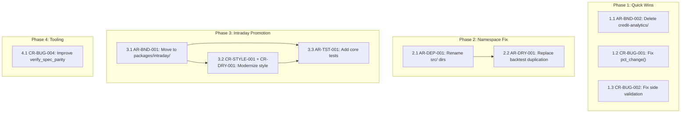
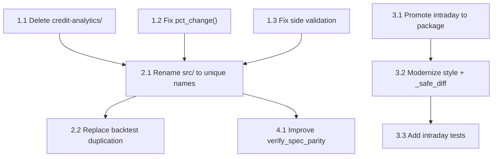

# Refactoring Roadmap

**Project:** FlowCode Credit Analytics
**Date:** 2026-03-01
**Findings consolidated:** 15 (8 architecture + 8 code review, 1 deduplicated)

## Executive Summary

FlowCode's 5 core packages are structurally sound (363 tests, clean DAG, defensive numeric code). The technical debt concentrates in three areas: (1) a dead `credit-analytics/` subtree with unsafe duplicates, (2) a `src/` namespace collision that blocks inter-package imports and forces formula duplication, and (3) ~1800 LOC of untested intraday analytics orphaned outside the package hierarchy. The plan addresses these in 4 phases: quick bug fixes, dead code deletion, namespace restructuring, and intraday module promotion — each leaving the system fully functional.

## Scorecard (Baseline)

| Dimension | Current | Target |
|---|---|---|
| Boundary Quality | 🟠 | 🟢 |
| Dependency Direction | 🟡 | 🟢 |
| Abstraction Fitness | 🟢 | 🟢 (preserve) |
| DRY & Knowledge | 🟠 | 🟢 |
| Extensibility | 🟡 | 🟢 |
| Testability | 🟠 | 🟡 (🟢 after Phase 4) |
| Parallelisation | 🟡 | 🟡 (deferred) |

## Consolidated Findings

| Finding ID | Finding | Source | Severity | Dimension | Impact | Scope | Risk | Priority |
|---|---|---|---|---|---|---|---|---|
| AR-BND-002 | Dead `credit-analytics/` subtree | arch-review | 🟠 | Boundaries | 4 | 1 | 1 | **6** |
| CR-BUG-001 | `pct_change()` deprecated in backtest | code-review | 🟠 | Correctness | 4 | 1 | 1 | **6** |
| CR-BUG-002 | Side validation accepts values downstream drops | code-review | 🟠 | Correctness | 4 | 1 | 2 | **5** |
| AR-TST-001 | 0 tests for 1800 LOC intraday code | arch-review | 🟠 | Testability | 4 | 3 | 1 | 4 |
| CR-BUG-004 | verify_spec_parity checks file existence only | code-review | 🟡 | Correctness | 3 | 1 | 1 | 4 |
| AR-DEP-001 | `src/` namespace collision blocks imports | arch-review | 🟡 | Dependencies | 5 | 5 | 3 | **2** ★ |
| AR-DRY-001 | `compute_metrics` re-implements Sharpe/drawdown | arch-review | 🟠 | DRY | 3 | 2 | 2 | 2 |
| AR-BND-001 | Intraday modules outside package hierarchy | arch-review | 🟠 | Boundaries | 4 | 3 | 3 | 2 |
| AR-EXT-001 | Composition packages blocked by namespace | arch-review | 🟡 | Extensibility | 3 | 5 | 3 | -2 |
| CR-STYLE-001 | `Optional` vs `X \| None` inconsistency | code-review | 🟡 | Style | 2 | 2 | 1 | 1 |
| CR-DRY-001 | `_safe_diff` duplicated between intraday modules | code-review | 🟡 | DRY | 2 | 2 | 1 | 1 |
| AR-PAR-001 | Sequential for-loops in intraday accumulators | arch-review | 🟡 | Parallelisation | 2 | 3 | 3 | -2 |
| CR-STYLE-002 | `__future__` import before module docstring | code-review | 🔵 | Style | 1 | 1 | 1 | 0 |
| CR-PERF-001 | Rating set reconstructed per call | code-review | 🔵 | Performance | 1 | 1 | 1 | 0 |

**★ Load-bearing finding:** AR-DEP-001 has low priority score (cross-cutting + risky) but is the root cause of AR-DRY-001 and AR-EXT-001. Fixing it cascades structural improvements and unlocks inter-package composition. This is the 20% that yields 80%.

**Deduplication notes:**
- CR-BUG-003 (DataFrame mutation in credit-analytics) subsumed by AR-BND-002 (delete entire subtree)
- AR-EXT-001 is a consequence of AR-DEP-001 (fixed together in Phase 2)

## Dependency Graph

## Parallel Tracks

| Track | Steps | Theme | Can start immediately? |
|---|---|---|---|
| A | 1.1 → 1.2 → 1.3 | Bug fixes + cleanup | Yes |
| B | 2.1 → 2.2 | Namespace restructuring | Yes (independent of Track A) |
| C | 3.1 → 3.2 → 3.3 | Intraday promotion | After Phase 1 or 2 (either order) |
| D | 4.1 | Tooling improvement | After Phase 2 |

---

## Phase 1: Quick Wins — Bugs and Dead Code
**Target:** No deprecated API calls, no side-validation gaps, no dead code confusing contributors.
**Effort:** single-function to single-module scope. 3 independent steps.

### Step 1.1: Delete `credit-analytics/` subtree

**Finding IDs:** AR-BND-002, CR-BUG-003
**Priority score:** 6
**Scope:** multi-module
**Risk level:** low

**What changes:**
- Delete entire `credit-analytics/` directory (apps/, packages/, skills/, spec/, tools/)
- Verify no imports reference `credit-analytics/` from anywhere in the repo

**What doesn't change:**
- All code in `packages/` (the canonical implementations)
- All tests, fixtures, spec/SPEC.md
- CLAUDE.md (already documents packages/ as canonical)

**Verification:**
- [ ] `git grep 'credit.analytics\|credit_analytics' -- '*.py'` returns 0 matches
- [ ] All 363 tests still pass
- [ ] `credit-analytics/` directory no longer exists

**Depends on:** none
**Blocks:** none

**Rollback:** `git checkout -- credit-analytics/`

---

### Step 1.2: Fix `pct_change()` deprecation in backtest

**Finding IDs:** CR-BUG-001
**Priority score:** 6
**Scope:** single-function
**Risk level:** low

**What changes:**
- `packages/backtest/src/engine.py:L52`: Replace `prices.pct_change()` with `prices / prices.shift(1) - 1`
- Match the pattern already used in `packages/alphaeval/src/transforms/returns.py:L40`

**What doesn't change:**
- Output values (mathematically identical when no NaN fill is needed)
- `compute_returns()` API
- All other backtest functions

**Verification:**
- [ ] All backtest tests pass
- [ ] No `FutureWarning` about `pct_change` in test output
- [ ] `grep -r 'pct_change' packages/` returns only `backtest/src/portfolio.py:L116` (risk_parity, separate fix if needed)

**Depends on:** none
**Blocks:** none

**Rollback:** Revert the one-line change.

---

### Step 1.3: Fix side validation to match downstream expectations

**Finding IDs:** CR-BUG-002
**Priority score:** 5
**Scope:** single-function
**Risk level:** low

**What changes:**
- `packages/data/src/validation.py:L153`: Change `valid_sides` from `{"B", "S", "buy", "sell", "BUY", "SELL"}` to `{"B", "S"}` as the canonical side values
- Add a warning if non-canonical sides are found, with a message suggesting normalization

**What doesn't change:**
- `validate_trace()` return type and API
- Downstream functions (they already expect only "B"/"S")
- `aggregate_daily_volume`, `compute_retail_imbalance` (already filter on "B"/"S")

**Verification:**
- [ ] All data package tests pass
- [ ] `validate_trace()` with `side="buy"` now produces a warning
- [ ] No test fixtures use non-canonical side values

**Depends on:** none
**Blocks:** none

**Rollback:** Revert the set literal.

---

## Phase 2: Namespace Fix — Enable Inter-Package Imports ★
**Target:** Each package has a unique importable name. `backtest` can import from `metrics`. No formula duplication.
**Effort:** cross-cutting. Highest-impact structural change in this plan.

### Step 2.1: Rename `src/` directories to unique package names

**Finding IDs:** AR-DEP-001, AR-EXT-001
**Priority score:** 2 (but load-bearing — unlocks Phase 2.2 and future composition)
**Scope:** cross-cutting
**Risk level:** medium

**What changes:**
- `packages/data/src/` → `packages/data/flowcode_data/`
- `packages/signals/src/` → `packages/signals/flowcode_signals/`
- `packages/metrics/src/` → `packages/metrics/flowcode_metrics/`
- `packages/backtest/src/` → `packages/backtest/flowcode_backtest/`
- `packages/alphaeval/src/` → `packages/alphaeval/flowcode_alphaeval/`
- Update all intra-package relative imports (they use `.module` so should work)
- Update test imports: `from src.X import Y` → `from flowcode_X.X import Y`
- Update `__init__.py` files and any `sys.path` manipulation

**What doesn't change:**
- All public APIs and function signatures
- All formula implementations
- All fixture files and spec references
- CLAUDE.md code locations (uses `signals.retail.compute_retail_imbalance()` not `src.retail`)

**Verification:**
- [ ] All 363 tests pass (run per-package as before)
- [ ] `from flowcode_metrics.performance import sharpe_ratio` works from `flowcode_backtest`
- [ ] No `src` directory remains in any package
- [ ] `grep -r 'from src\.' packages/` returns 0 matches (no old imports)

**Depends on:** none (but recommended after Phase 1 for a clean starting point)
**Blocks:** Step 2.2

**Rollback:** `git checkout -- packages/` to restore `src/` structure.

---

### Step 2.2: Replace duplicated metrics in backtest with imports

**Finding IDs:** AR-DRY-001
**Priority score:** 2
**Scope:** single-module
**Risk level:** low

**What changes:**
- `packages/backtest/flowcode_backtest/engine.py:compute_metrics()`: Replace inline Sharpe, drawdown, annualized return calculations with imports from `flowcode_metrics.performance` and `flowcode_metrics.risk`
- Remove the comment "Cross-package imports are not possible due to shared src/ namespace"

**What doesn't change:**
- `compute_metrics()` return type and keys
- `run_backtest()` API
- All other backtest functions

**Verification:**
- [ ] `compute_metrics()` returns identical values for test inputs (compare before/after)
- [ ] All backtest tests pass
- [ ] `engine.py` no longer contains inline Sharpe/drawdown formulas
- [ ] `grep 'Cross-package imports are not possible' packages/` returns 0 matches

**Depends on:** Step 2.1
**Blocks:** none

**Rollback:** Revert engine.py to inline implementations (still works without inter-package imports).

---

## Phase 3: Intraday Module Promotion — Governed Code
**Target:** Intraday analytics promoted to `packages/intraday/` with standard structure, modernized style, and core test coverage.
**Effort:** multi-module. 3 sequential steps.

### Step 3.1: Promote intraday modules to `packages/intraday/`

**Finding IDs:** AR-BND-001
**Priority score:** 2
**Scope:** multi-module
**Risk level:** medium

**What changes:**
- Create `packages/intraday/flowcode_intraday/` directory structure
- Move `intraday_microstructure_analytics.py` → `packages/intraday/flowcode_intraday/analytics.py`
- Move `intraday_quote_filters.py` → `packages/intraday/flowcode_intraday/filters.py`
- Create `packages/intraday/flowcode_intraday/__init__.py` with public API exports
- Create `packages/intraday/tests/__init__.py`
- Remove root-level `intraday_*.py` files
- Update CLAUDE.md "Standalone modules" section → reference new location

**What doesn't change:**
- All function signatures, class definitions, and enum values
- All other packages (no package imports intraday currently)
- Spec and fixtures (intraday is not spec-governed)

**Verification:**
- [ ] `from flowcode_intraday.analytics import CompositeSource, bid_ask_spread` works
- [ ] `from flowcode_intraday.filters import detect_directional_pressure` works
- [ ] Root-level `intraday_*.py` files no longer exist
- [ ] CLAUDE.md updated to reflect new location
- [ ] All 363 existing tests still pass (no regression from move)

**Depends on:** none (can be done before or after Phase 2, but after Phase 1 preferred)
**Blocks:** Step 3.2, Step 3.3

**Rollback:** Move files back to root, restore original names.

---

### Step 3.2: Modernize intraday style + single-source `_safe_diff`

**Finding IDs:** CR-STYLE-001, CR-DRY-001
**Priority score:** 1
**Scope:** multi-module
**Risk level:** low

**What changes:**
- Add `from __future__ import annotations` to both intraday modules
- Replace all `Optional[X]` with `X | None`
- Remove `from typing import Optional` import
- Extract shared `_safe_diff()` to `packages/intraday/flowcode_intraday/_utils.py`
- Import `_safe_diff` in both analytics.py and filters.py from `_utils`

**What doesn't change:**
- All function signatures (type annotations are string-evaluated with `__future__`)
- All logic and output values
- Public API

**Verification:**
- [ ] `grep 'Optional' packages/intraday/` returns 0 matches
- [ ] `_safe_diff` exists in exactly 1 file (`_utils.py`)
- [ ] Both modules import from `_utils`
- [ ] All existing tests still pass

**Depends on:** Step 3.1
**Blocks:** Step 3.3

**Rollback:** Revert style changes (no behavioral impact).

---

### Step 3.3: Add core tests for intraday analytics

**Finding IDs:** AR-TST-001
**Priority score:** 4
**Scope:** multi-module
**Risk level:** low

**What changes:**
- Create `packages/intraday/tests/test_analytics.py` with tests for:
  - `_make_reset_mask` (DAILY, WEEKLY, INTRADAY_SESSION, ON_EVENT, NEVER)
  - `intraday_spread_range` (NaN at session boundary, normal accumulation)
  - `cumulative_spread_move` (session open NaN recovery)
  - `bid_ask_regime` (tight/normal/wide/crossed/unknown classification)
  - `carry_per_unit_risk` (near-zero cr01 guard)
- Create `packages/intraday/tests/test_filters.py` with tests for:
  - `_safe_diff` (cross-ISIN contamination guard)
  - `filter_significant_quote_moves` (direction parameter validation)
  - `detect_directional_pressure` (combined signal aggregation)
  - `aggregate_trace_to_bins` (empty input handling)

**What doesn't change:**
- All implementation code (tests are additive)
- All other packages and their tests

**Verification:**
- [ ] `cd packages/intraday && pytest tests/ -v` passes
- [ ] Coverage of `_make_reset_mask` ≥ 80% (all policies tested)
- [ ] Coverage of `_safe_diff` ≥ 90% (critical guard)
- [ ] ≥ 15 test cases total across both test files

**Depends on:** Step 3.1, Step 3.2
**Blocks:** none (AR-PAR-001 deferred, but would depend on this)

**Rollback:** Delete test files (no behavioral impact).

---

## Phase 4: Tooling — Better Spec Parity
**Target:** `verify_spec_parity.py` checks function existence and fixture loading, not just file existence.
**Effort:** single-module.

### Step 4.1: Improve verify_spec_parity to check function existence

**Finding IDs:** CR-BUG-004
**Priority score:** 4
**Scope:** single-module
**Risk level:** low

**What changes:**
- `tools/verify_spec_parity.py:check_code_location()`: After confirming file exists, also verify the named function exists in the module (via `importlib` or `ast.parse`)
- Add a `check_fixture_valid()` function that loads fixture JSON and verifies it has the expected structure (input/output keys)
- Update package import paths to use new namespace from Phase 2

**What doesn't change:**
- The tool remains a standalone CLI script
- Spec/fixture files unchanged
- All package code unchanged

**Verification:**
- [ ] `python3 tools/verify_spec_parity.py` runs without error
- [ ] Tool detects a deliberately misnamed function (rename one temporarily, run, confirm detection)
- [ ] Tool validates at least 18 formula entries

**Depends on:** Step 2.1 (needs updated import paths)
**Blocks:** none

**Rollback:** Revert to file-existence-only checks.

---

## Expected Outcome

| Dimension | Before | After Phase 1 | After Phase 2 | After Phase 3 | After Phase 4 |
|---|---|---|---|---|---|
| Boundary Quality | 🟠 | 🟡 | 🟡 | 🟢 | 🟢 |
| Dependency Direction | 🟡 | 🟡 | 🟢 | 🟢 | 🟢 |
| Abstraction Fitness | 🟢 | 🟢 | 🟢 | 🟢 | 🟢 |
| DRY & Knowledge | 🟠 | 🟠 | 🟢 | 🟢 | 🟢 |
| Extensibility | 🟡 | 🟡 | 🟢 | 🟢 | 🟢 |
| Testability | 🟠 | 🟠 | 🟠 | 🟡 | 🟡 |
| Parallelisation | 🟡 | 🟡 | 🟡 | 🟡 | 🟡 |

## What This Plan Does NOT Address

| Finding ID | Finding | Why deferred |
|---|---|---|
| AR-PAR-001 | Sequential for-loops in intraday accumulators | Performance optimization, not correctness. Requires tests first (Phase 3). Consider after production load data is available. |
| CR-STYLE-002 | `__future__` import before docstring in 2 files | Cosmetic; Python accepts both orderings. Low impact. |
| CR-PERF-001 | Rating set reconstruction per call | Premature optimization. Current scale doesn't warrant `pd.Categorical`. |
| AR-ABS-001 | Positive finding (pure functions) | No action needed — preserve current pattern. |

---

## Handoff

### Dependency Graph

### Phase 1: Quick Wins

**Step 1.1: Delete credit-analytics/ subtree**
- Finding IDs: AR-BND-002, CR-BUG-003
- Scope: multi-module
- Risk: low
- What changes: Delete entire `credit-analytics/` directory
- What doesn't change: All `packages/` code, tests, spec, CLAUDE.md
- Verification:
  - [ ] `git grep 'credit.analytics' -- '*.py'` returns 0
  - [ ] All 363 tests pass
- Depends on: none
- Blocks: none
- Status: PENDING

**Step 1.2: Fix pct_change() deprecation**
- Finding IDs: CR-BUG-001
- Scope: single-function
- Risk: low
- What changes: `backtest/src/engine.py:L52` — use `prices / prices.shift(1) - 1`
- What doesn't change: `compute_returns()` API and output values
- Verification:
  - [ ] All backtest tests pass
  - [ ] No `FutureWarning` in test output
- Depends on: none
- Blocks: none
- Status: PENDING

**Step 1.3: Fix side validation gap**
- Finding IDs: CR-BUG-002
- Scope: single-function
- Risk: low
- What changes: `validation.py:L153` — restrict `valid_sides` to `{"B", "S"}`
- What doesn't change: `validate_trace()` return type; downstream functions unchanged
- Verification:
  - [ ] All data tests pass
  - [ ] Non-canonical sides produce warning
- Depends on: none
- Blocks: none
- Status: PENDING

### Phase 2: Namespace Restructuring

**Step 2.1: Rename src/ to unique package names**
- Finding IDs: AR-DEP-001, AR-EXT-001
- Scope: cross-cutting
- Risk: medium
- What changes: Rename all `packages/*/src/` to `packages/*/flowcode_*/`; update all imports
- What doesn't change: All public APIs, formulas, fixtures
- Verification:
  - [ ] All 363 tests pass
  - [ ] Inter-package imports work
  - [ ] No `from src.` imports remain
- Depends on: none
- Blocks: 2.2, 4.1
- Status: PENDING

**Step 2.2: Replace backtest formula duplication**
- Finding IDs: AR-DRY-001
- Scope: single-module
- Risk: low
- What changes: `engine.py:compute_metrics()` imports from `flowcode_metrics` instead of inline formulas
- What doesn't change: `compute_metrics()` return type and keys
- Verification:
  - [ ] Identical output values for test inputs
  - [ ] All backtest tests pass
  - [ ] No inline Sharpe/drawdown formulas in engine.py
- Depends on: 2.1
- Blocks: none
- Status: PENDING

### Phase 3: Intraday Promotion

**Step 3.1: Promote intraday to packages/intraday/**
- Finding IDs: AR-BND-001
- Scope: multi-module
- Risk: medium
- What changes: Move `intraday_*.py` to `packages/intraday/flowcode_intraday/`; create __init__.py
- What doesn't change: All function signatures, classes, enums
- Verification:
  - [ ] Imports from new package work
  - [ ] Root-level files removed
  - [ ] CLAUDE.md updated
  - [ ] All 363 existing tests pass
- Depends on: none
- Blocks: 3.2, 3.3
- Status: PENDING

**Step 3.2: Modernize style + single-source _safe_diff**
- Finding IDs: CR-STYLE-001, CR-DRY-001
- Scope: multi-module
- Risk: low
- What changes: Add `__future__` annotations, replace `Optional` → `X | None`, extract `_safe_diff` to `_utils.py`
- What doesn't change: All logic, output values, public API
- Verification:
  - [ ] `grep 'Optional' packages/intraday/` returns 0
  - [ ] `_safe_diff` in exactly 1 file
  - [ ] All tests pass
- Depends on: 3.1
- Blocks: 3.3
- Status: PENDING

**Step 3.3: Add core intraday tests**
- Finding IDs: AR-TST-001
- Scope: multi-module
- Risk: low
- What changes: Create test files for analytics and filters; ≥15 test cases
- What doesn't change: All implementation code (additive only)
- Verification:
  - [ ] `pytest packages/intraday/tests/ -v` passes
  - [ ] `_make_reset_mask` and `_safe_diff` coverage ≥ 80%
  - [ ] ≥ 15 test cases
- Depends on: 3.1, 3.2
- Blocks: none
- Status: PENDING

### Phase 4: Tooling

**Step 4.1: Improve verify_spec_parity**
- Finding IDs: CR-BUG-004
- Scope: single-module
- Risk: low
- What changes: Check function existence in module (not just file); validate fixture JSON structure
- What doesn't change: Tool remains standalone CLI script; no package changes
- Verification:
  - [ ] `python3 tools/verify_spec_parity.py` succeeds
  - [ ] Misnamed function detected when tested
  - [ ] 18 formula entries validated
- Depends on: 2.1
- Blocks: none
- Status: PENDING
